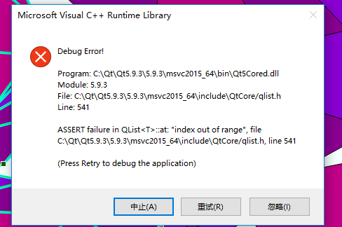

# QT所遇到的一些小问题

### 中文乱码问题

Qt如果需要输入一些中文字符到控件中，比如将ComboBox中加入一些项，
会出现乱码。这个始终是Qt的一个Bug。
而网上也没有妥善的解决方案解决这个问题。
针对这个问题，可以用如下方法解决

在文件的开头加上:
``` C++
#pragma execution_character_set(“utf-8”)
```
**注意:这个预处理指令只适用于QString,如果是别的，可能仍然无法解决问题**


###被选中元素输出顺序

当在视图中选中了一些地物，可以用以下代码:
``` C++
    GsSelectionSet* pSelectSet = pVectorLayer->SelectionSet();
    GsEnumIDsPtr ptrIds = pSelectSet->EnumIDs();
    long long oid;
    QList<long long> lstOids;
    while ((oid = ptrIds->Next()) != -1)
    {
        //oid列表
        lstOids.append(oid);
        LOGINFO(QString::number(oid));
    }
    return lstOids;
```
**注意:选中的地物输出的顺序是以OID从大到小的顺序输出的**


### QComboBox的Clear异常报错
Qt中当QComboBox调用了如下信号与槽函数: 
``` C++
    QObject::connect(ui->sourceComboBox,SIGNAL(currentIndexChanged(int)),this,SLOT(gLayer()));
```    
再将QComboBox.clear()清空， 则会出现异常报错。


问题原因:
因为在信号与槽函数响应后，会记录下当前索引的位置，而若再进行QComboBox.clear()，
则会导致QComboBox分配的数组大小为空，记录的索引指不到该位置，于是会出现“Index out of range”的错误。

解决方法：
将信号函数替换为activated(int)则解决了这个问题。
``` C++
    QObject::connect(ui->sourceComboBox,SIGNAL(activated(int)),this,SLOT(gLayer()));
```


